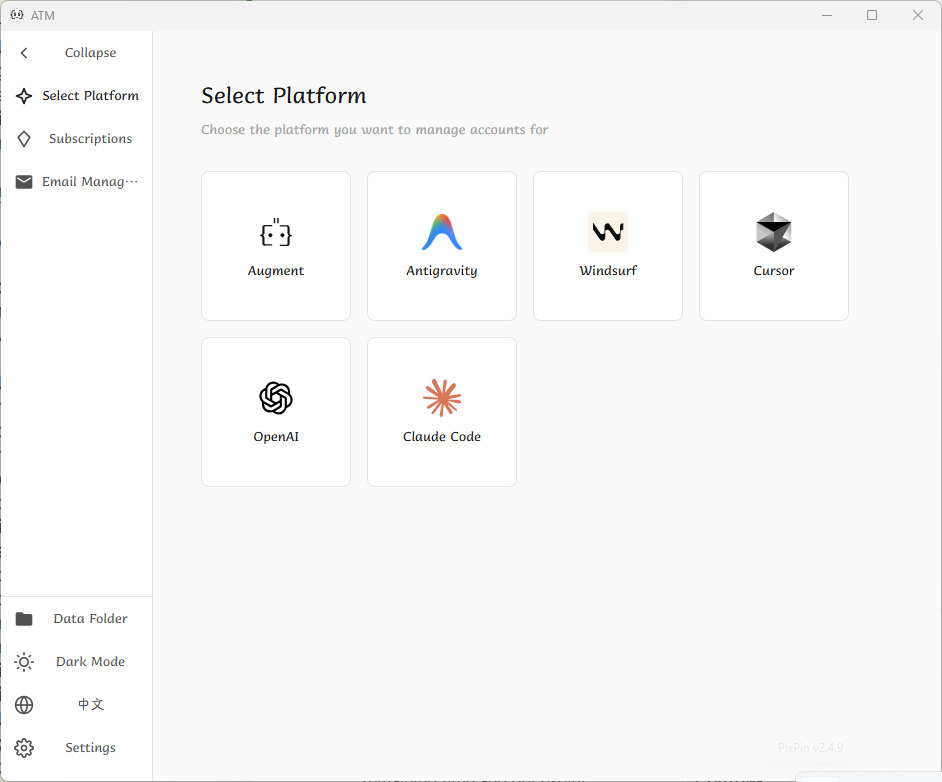

# AI Tools Manager

A cross-platform desktop app built with Tauri for managing AI Tools, accounts, subscriptions and email across multiple platforms.



## Overview

- **Accounts & platforms**: Augment, Antigravity, Windsurf, Cursor, OpenAI (Codex, API), Claude Code and API — account management and one-click account switching.
- **Proxy**: Codex local proxy for use with Codex Cli/Droid only.
- **Subscriptions**: Subscription management with expiry dates and Telegram notifications; view remaining time and get expiry reminders.
- **Email**: iCloud Hide My Email (HME) — requires iCloud+; create addresses and deactivate or delete them.

## Tech stack

- Tauri 2 (Rust)
- Vue 3, Pinia
- Tailwind 4
- Vite

## Installation

### Package managers (recommended)

#### macOS — Homebrew

```bash
# Install Homebrew (if needed)
/bin/bash -c "$(curl -fsSL https://raw.githubusercontent.com/Homebrew/install/HEAD/install.sh)"

# Install ATM
brew tap cubezhao/atm
brew install --cask atm
# Update
brew update
brew upgrade --cask atm
# Uninstall
brew uninstall --cask atm
```

#### Windows — Scoop

```powershell
# Install Scoop (if needed)
Set-ExecutionPolicy RemoteSigned -Scope CurrentUser
irm get.scoop.sh | iex

# Install ATM
scoop bucket add atm https://github.com/cubezhao/scoop-atm
scoop install atm
# Update
scoop update atm
# Uninstall
scoop uninstall atm
```

### Release builds

Download installers from [Releases](https://github.com/cubezhao/augment-token-mng/releases).

### Install issues

**macOS**: If you see “ATM.app is damaged and can’t be opened”, run in Terminal:

`sudo xattr -dr com.apple.quarantine /Applications/ATM.app`

### Build from source

1. **Install Rust**

   ```bash
   # Windows (PowerShell)
   Invoke-WebRequest -Uri https://win.rustup.rs/ -OutFile rustup-init.exe
   .\rustup-init.exe

   # macOS/Linux
   curl --proto '=https' --tlsv1.2 -sSf https://sh.rustup.rs | sh
   ```

2. **Install Node.js**  
   From [nodejs.org](https://nodejs.org/) or a package manager (e.g. `winget install OpenJS.NodeJS`).

3. **Install Tauri CLI**

   ```bash
   cargo install tauri-cli
   ```

### Quick build

**Windows:**

```powershell
cd augment-token-mng
.\build.ps1
```

**macOS/Linux:**

```bash
cd augment-token-mng
chmod +x build.sh
./build.sh
```

**Docker:**

```bash
chmod +x docker/build.sh
./docker/build.sh linux    # Linux
./docker/build.sh cross    # Cross-platform
./docker/build.sh dev      # Dev environment
```

### Manual build

**Dev:**

```bash
cd augment-token-mng
pnpm install
pnpm tauri dev
```

**Release:**

```bash
cd augment-token-mng
pnpm install
pnpm tauri build
```

## License

MIT.

## Support

If this project helps you, you can buy me a coffee.

<table align="center">
  <tr>
    <td align="center" style="padding: 20px; background: rgba(232, 248, 236, 0.6); border-radius: 16px;">
      <h4>WeChat Pay</h4>
      
    </td>
    <td align="center" style="padding: 20px; background: rgba(234, 243, 255, 0.6); border-radius: 16px;">
      <h4>Alipay</h4>
      
    </td>
  </tr>
</table>

## Star History

[](https://star-history.com/#cubezhao/augment-token-mng&Date)
