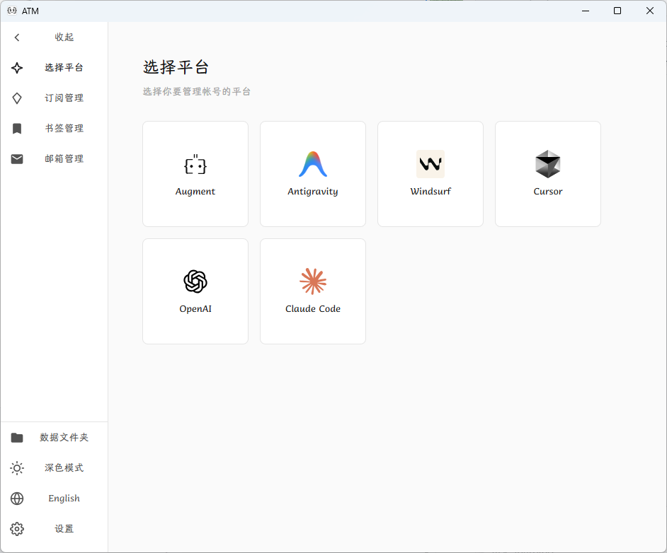
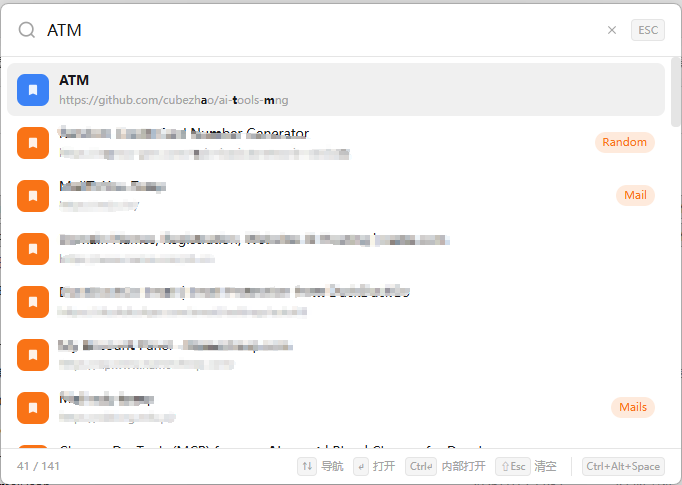

# AI Tools Manager

[English](README.en.md) | 中文

基于 Tauri 的跨平台桌面应用，用于管理多平台 AI 账号，以及订阅与邮箱。





## 功能概览

- **账号与平台**：支持 Augment、Antigravity、Windsurf、Cursor、OpenAI（Codex、API）、Claude Code 与 API 账号管理与一键切号。
- **代理**：支持 Codex 本地透传反代，仅限在 Codex Cli/Droid 中使用。
- **订阅**：支持订阅管理，配置到期时间与 Telegram 通知，查看剩余时间与到期提醒。
- **书签**：支持书签管理，可手动添加、从浏览器导入（Chrome/Firefox/Edge/Safari）或从 Raindrop.io 导入；支持标签分类、搜索过滤、云端同步、类似 Raycast 的快捷搜索。
- **邮箱**：
  - **iCloud HME**：iCloud 隐藏邮箱的生成、停用和删除（需 iCloud+ 账号）。
  - **Outlook**：Outlook 邮箱账户管理，支持手动导入和 OAuth 授权添加，Token 自动刷新，邮件查看与批量状态检查。
  - **GPTMail**：通过 GPTMail API 生成随机邮箱，收取邮件与验证码，支持自动轮询和历史记录管理。

## 技术栈

- Tauri 2（Rust）
- Vue3、Pinia
- Tailwind 4
- Vite

## 安装指南

### 包管理器安装（推荐）

#### MacOS - Homebrew
```bash
# 安装 Homebrew（如果尚未安装）
/bin/bash -c "$(curl -fsSL https://raw.githubusercontent.com/Homebrew/install/HEAD/install.sh)"

# 使用 Homebrew 安装依赖
brew tap cubezhao/atm
brew install --cask atm
# 更新
brew update
brew upgrade --cask atm
# 卸载
brew uninstall --cask atm
```

#### Windows - Scoop
```powershell
# 安装 Scoop（如果尚未安装）
Set-ExecutionPolicy RemoteSigned -Scope CurrentUser
irm get.scoop.sh | iex

# 使用 Scoop 安装依赖
scoop bucket add atm https://github.com/cubezhao/scoop-atm
scoop install atm
# 更新
scoop update atm
# 卸载
scoop uninstall atm
```

### Release 下载安装
在[Release](https://github.com/cubezhao/ai-tools-mng/releases) 中根据平台选择对应的安装包进行安装即可

### 安装问题
MacOS平台安装之后出现“ATM.app已损坏，无法打开...”，在终端执行以下命令即可

`sudo xattr -dr com.apple.quarantine /Applications/ATM.app`

### 手动环境准备

1. **安装 Rust**：
   ```bash
   # Windows (PowerShell)
   Invoke-WebRequest -Uri https://win.rustup.rs/ -OutFile rustup-init.exe
   .\rustup-init.exe
   
   # macOS/Linux
   curl --proto '=https' --tlsv1.2 -sSf https://sh.rustup.rs | sh
   ```

2. **安装 Node.js**：
   - 从 [nodejs.org](https://nodejs.org/) 下载安装
   - 或使用包管理器（例如：`winget install OpenJS.NodeJS`）

3. **安装 Tauri CLI**：
   ```bash
   cargo install tauri-cli
   ```

### 快速构建

#### Windows：
```powershell
cd ai-tools-mng
.\build.ps1
```

#### macOS/Linux：
```bash
cd ai-tools-mng
chmod +x build.sh
./build.sh
```

#### Docker
```bash
# Make build script executable
chmod +x docker/build.sh

# Build for Linux
./docker/build.sh linux

# Cross-platform build
./docker/build.sh cross

# Start development environment
./docker/build.sh dev
```

### 手动构建

#### 开发模式：
```bash
cd ai-tools-mng
npm install          # 安装前端依赖
cargo tauri dev      # 启动开发服务器
```

#### 发布构建：
```bash
cd ai-tools-mng
npm install          # 安装前端依赖
cargo tauri build    # 构建生产版本
```


## 许可证

本项目是开源项目，采用 MIT 许可证。

## ❤️ 赞助支持

如果该项目对你有帮助，可以请我喝杯咖啡

<table align="center">
  <tr>
    <td align="center" style="padding: 20px; background: rgba(232, 248, 236, 0.6); border-radius: 16px;">
      <h4>⭐ 微信支付</h4>
      
    </td>
    <td align="center" style="padding: 20px; background: rgba(234, 243, 255, 0.6); border-radius: 16px;">
      <h4>⭐ 支付宝</h4>
      
    </td>
  </tr>
</table>

## ⭐ Star History

[](https://star-history.com/#cubezhao/ai-tools-mng&Date)
